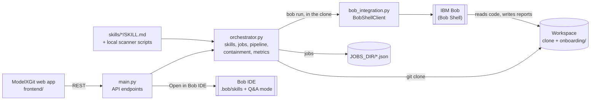

# ModelXGit · Model X

**AI developer onboarding, powered by IBM Bob.** Paste a GitHub or GitLab repository link. The
backend clones it and runs eight IBM Bob skills that set it up, map its tech stack and
architecture, audit it (and its whole git history) for leaked secrets, answer role-based
questions and write the README. Then it hands the repository over to **Bob IDE** with the same
skills, so the developer keeps working with Bob.

> Built for the IBM Bob 2.0 Hackathon (lablab.ai) by team Model X.
> This README was drafted by our own `readme-generator` skill running on IBM Bob against this
> repository, then reviewed and corrected by the team.

**Quick start:** see [HOW_TO_RUN.md](HOW_TO_RUN.md), or run `start.ps1` (Windows) / `./start.sh`
(macOS, Linux). Without a Bob key it starts with a clearly labelled stand-in.

---

## How IBM Bob is used

| Where | What Bob does |
|---|---|
| **8 Bob skills** (`skills/*/SKILL.md`) | Each skill is a Bob skill with instructions and frontmatter (`trigger`, `after`, `depends_on`, `parallel_group`, `produces`). The backend runs them as a pipeline. |
| **Bob Shell, headless** (`bob run`) | Every skill runs inside the cloned repo. Bob reads the code itself and writes its reports to `onboarding/`. |
| **Codebase Q&A** | Role-based answers with file and line references, plus suggested follow-up questions. |
| **Bob IDE hand-off** | Each clone gets our skills in `.bob/skills/` and a **Codebase Q&A** mode in `.bob/custom_modes.yaml`; one click opens it in Bob IDE. |

## Pipeline

1. **You confirm the clone** → the backend clones the repo (full history), measures the basics,
   and Bob writes the clone report (`repo-clone`).
2. **Automatically, in parallel:** `setup-dependencies`, `tech-stack-detection`,
   `git-history-secret-audit`, `secret-precommit-scanner`, then `architecture-diagram`
   (waits for `tech-stack-detection`).
3. **On request:** `codebase-qa` and `readme-generator` (waits for setup, tech stack and
   architecture).

## Key features

- **One-click onboarding** with live progress, retry of failed skills, and jobs that survive a
  backend restart.
- **Impact metrics, measured by the backend:** time to onboard, files produced, secret findings,
  Bob tool calls and cost (`onboarding/metrics.json`). The "x% faster" comparison appears only when
  you enter your team's own measured manual time.
- **Interactive architecture graph** from Bob's `architecture.json`, plus a Mermaid diagram.
- **Output contract:** every JSON file Bob writes is checked (required keys, types, valid graph
  edges) and flagged if something is wrong.
- **Onboarding pack:** all reports as one zip download.

## Security model

- **Bob can't run commands** (Bob Shell's `execute`, `browser`, `mcp`, `subagent`, `skill` and
  `mode` tool groups are disabled for pipeline runs).
- **Bob may only write to `onboarding/` and `README.md`.** After every run the backend undoes any
  other change, including git-ignored files such as a new `.env`.
- **Secret files are hidden from Bob** by a `.bobignore` written into every clone (keys,
  certificates, credentials, `.npmrc`...). Tested with real Bob: without it Bob read committed
  `.pem`, `credentials.json` and `.npmrc` files; with it, none.
- **No secrets in outputs:** every file Bob writes is scanned with our own rules and secret-looking
  values are masked automatically.
- **Secret scanners run locally** (`scripts/history_scan.py`, `scripts/precommit_scan.py`); only
  masked results reach Bob. The pre-commit hook blocks commits that contain secrets.
- **Safe cloning:** only `https://`, `ssh://` and `git@` URLs; no local paths, `file://`,
  option injection or credentials in the URL; symlinks are never followed.
- **API keys** live only in `.env` (git-ignored) and are passed to Bob Shell through its
  environment, never logged.

## Measured results

From a real IBM Bob run of the full pipeline on this repository (Model X, `pipeline-frontend`):

| Measure | Result |
|---|---|
| Automatic pipeline (clone + 5 skills) | 4 min 38 s |
| Skills completed | 8 / 8 (including Q&A and README) |
| Files produced | 15, all passing the output check |
| Bob usage | 8 runs, 122 tool calls |
| Changes outside `onboarding/`, README and the hand-off | none |

## Tech stack

| Layer | Technology |
|---|---|
| Backend | Python 3.10+, FastAPI, Uvicorn, Pydantic v2 |
| AI | IBM Bob via Bob Shell (`bobshell`, Node.js 22.15+) |
| Frontend | Vanilla HTML/CSS/JS (no build step), served by the backend at `/` |
| Diagrams | Custom architecture graph; Mermaid 11.4.1 from jsDelivr for `.mmd` files |
| Storage | Files on disk: clones in the workspace, jobs as JSON (`JOBS_DIR`) |
| Tests | pytest (`tests/`), GitHub Actions |

## Architecture



## Setup

Prerequisites: Git, Python 3.10+, and for real Bob: Node.js 22.15+ and
`npm install -g bobshell`.

```bash
git clone -b pipeline-frontend https://github.com/VincentTeo1116/ModelXGit.git
cd ModelXGit
# Windows
powershell -ExecutionPolicy Bypass -File start.ps1
# macOS / Linux
./start.sh
```

Open http://127.0.0.1:8000/ (API docs at `/docs`, health at `/api/health`).

Manual start instead of the scripts: `python -m venv .venv`, install `requirements.txt`, then
`uvicorn main:app --port 8000`.

## Environment variables

Copy `.env.example` to `.env`. **Never commit `.env`.**

| Variable | Needed | Purpose |
|---|---|---|
| `BOB_API_KEY` | real Bob | Your IBM Bob API key (bob.ibm.com → API keys) |
| `BOB_ACCEPT_LICENSE` | real Bob | `true` only after reading `bob --show-license` |
| `BOB_CLIENT` | no | `shell` (default) or `http` (the local stand-in) |
| `BOB_TEAM_ID` | sometimes | Only for API keys of type "general" |
| `MANUAL_BASELINE_MINUTES` | no | Your team's measured manual onboarding time, for the "x% faster" comparison |
| `MAX_PARALLEL_SKILLS` | no | Bob runs at the same time (default 3) |
| `BOB_MAX_TURNS` / `BOB_MAX_COST` / `BOB_SHELL_TIMEOUT` | no | Limits per skill run |
| `BOB_RETRIES` | no | Retries for temporary Bob failures (default 1) |
| `WORKSPACE_DIR` / `JOBS_DIR` | no | Where clones and saved jobs go |

All options are listed in `.env.example`.

## API

| Method | Path | Purpose |
|---|---|---|
| GET | `/api/health` | Bob connection, skills, launcher, warnings |
| GET | `/api/skills` | Entry, automatic and manual skills |
| POST | `/api/repos/clone` | `{"repo_url", "branch"?, "depth"?, "confirm": true}` starts the pipeline |
| GET | `/api/jobs`, `/api/jobs/{id}` | Jobs and step results |
| GET | `/api/jobs/{id}/metrics`, `/api/metrics` | Measured impact per job and in total |
| POST | `/api/repos/{repo_id}/skills/{skill}/run` | Run a manual skill (Q&A body: `{"role", "question"}`) or retry a failed one |
| GET | `/api/repos/{repo_id}/files[/{path}]`, `/pack.zip` | Onboarding files, one file, or all as a zip |
| POST | `/api/repos/{repo_id}/open-in-bob` | Open the clone in Bob IDE (only from the same computer) |

## Tests

```bash
pip install -r requirements.txt -r requirements-dev.txt
pytest -q
```

The suite uses a fake Bob client and local repositories, so it needs no key and no network.
GitHub Actions runs it on every push (`.github/workflows/tests.yml`).

## Project structure

```
main.py              API endpoints + serves the web app
orchestrator.py      skills, jobs, pipeline, containment, output checks, metrics
bob_integration.py   Bob Shell client (and the HTTP client used by the stand-in)
config.py            settings from .env
skills/              the 8 Bob skills (SKILL.md) and the local secret scanners
frontend/            the ModelXGit web app
devtools/mock_bob.py labelled stand-in for demos without a Bob key
tests/               pytest suite
start.ps1, start.sh  one-command start
```

Each onboarded repository gets `onboarding/` (Bob's reports and `metrics.json`), `.bob/` (skills
and the Q&A mode for Bob IDE) and `.bobignore` inside its clone, not in this repository.

## Known limitations

- **No authentication** on the API. Keep it on `127.0.0.1` or put it behind a proxy with auth.
- **Public repositories only.**
- **The Bob IDE button** only works on the computer running the backend.
- **Bob's cost grows with repo size:** one onboarding of this repo cost about 6 of Bob's cost units.
  Use `BOB_MAX_COST` to cap it.
- The `.mmd` diagram viewer loads Mermaid from a CDN; offline it shows the diagram text.
- The history scanner reports the documented fake demo key in this repo's first commit; Bob's audit
  marks it a false positive (no real key was ever committed).

## License

No license specified yet.
